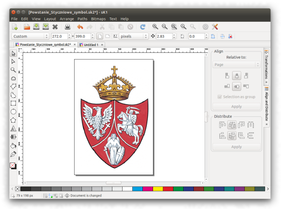

# sK1 2.0

   [](https://www.gnu.org/licenses/gpl-3.0)

<center>



</center>

sK1 2.0 is a cross-platform open source vector graphics editor similar to CorelDRAW, 
Adobe Illustrator, or Freehand. sK1 is oriented for prepress industry, 
so it works with CMYK color space and produces CMYK-based PDF and PS output.

sK1 Project (https://sk1project.net)

### How to install: 

---

* to build package:   `python setup.py build`
* to install package:   `python setup.py install`
* to remove installation: `python setup.py uninstall`

---

* to create source distribution:   `python setup.py sdist`

---

* to create binary RPM distribution:  `python setup.py bdist_rpm`
* to create binary DEB distribution:  `python setup.py bdist_deb`

---

* help on available distribution formats: `python setup.py bdist --help-formats`

---


## DETAILS

If you wish testing sK1 you have two installation ways. 
First option is a distutils install with commands:
```
python setup.py build
python setup.py install
```
But this way is not recommended. The most preferred option is a package 
installation (deb or rpm). You can create package using command:
```
python setup.py bdist_deb (for Ubuntu|Mint|Debian etc.)
python setup.py bdist_rpm (for Fedora|OpenSuse|Mageia etc.)
```
By installing the package you have full control over all the installed files 
and can easily remove them from the system (it's important for application
preview).

### Dependencies

Please note that application uses Python 2.x version. So Python interpreter
and python based dependencies should be for 2.x, but not 3.x

For successful build either distutils or deb|rpm package you need installing
some development packages. We describe dev-packages for Ubuntu|Debian, but for
other distros they have similar names. So, you need:
```
git
gettext
libcairo2-dev
liblcms2-dev
libmagickwand-dev
libpango1.0-dev
python-dev
python-cairo-dev
```

To run application you need installing also:
```
python-wxgtk3.0
python-pil 
python-reportlab
python-cairo
python-cups
```

Also the project depends on several subprojects: `uniconvertor`, `wal`, `build-utils`. You don't need to clone these sources manualy because `setup.py` does it for you automatically.
