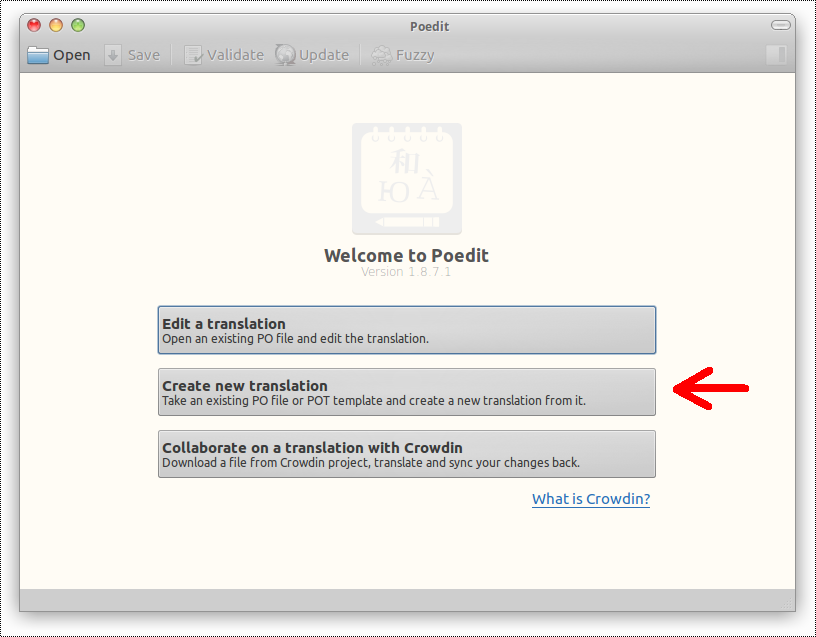
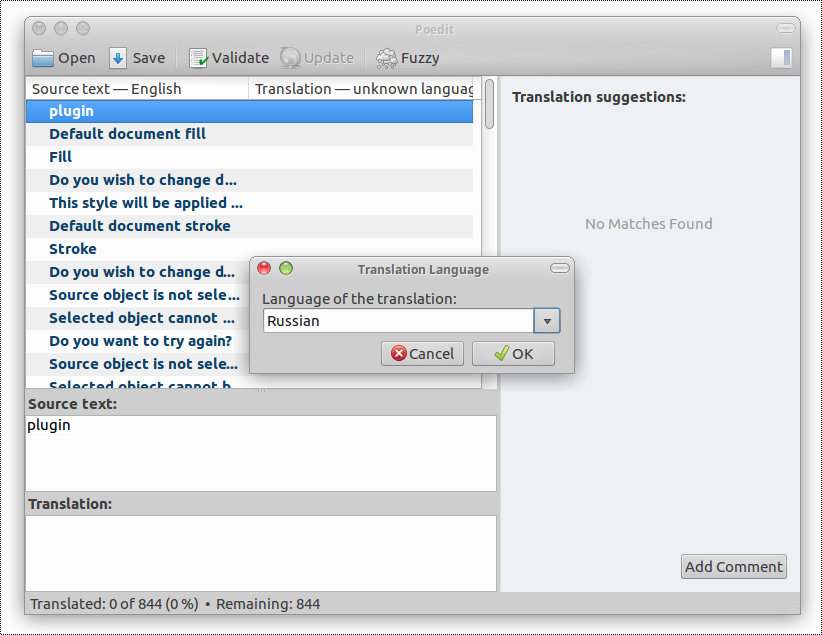
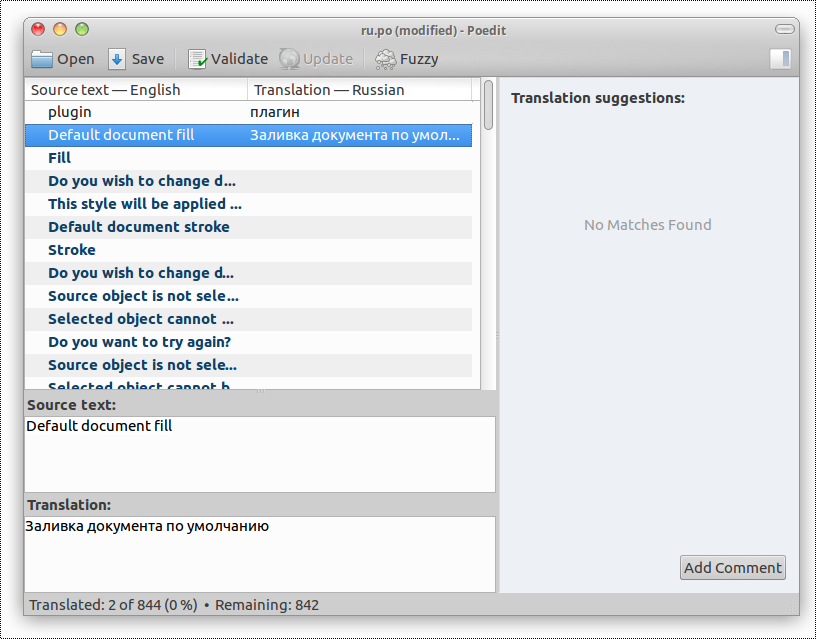
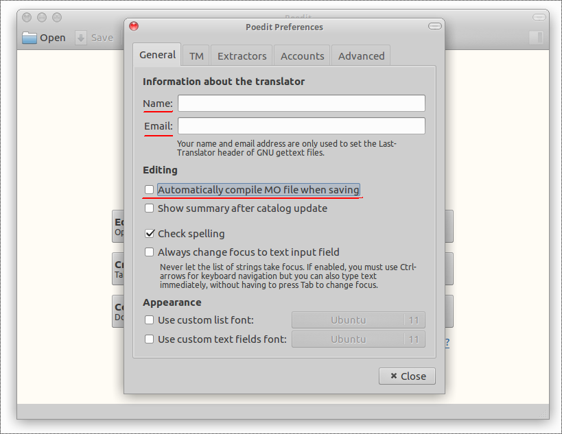

# How to translate sK1 user interface

Briefly translation has following steps:

* [Download sk1.pot template](https://raw.githubusercontent.com/sk1project/sk1-wx/master/sk1.pot)
* Install Poedit and setup correct preferences for it (see below)
* Open this template in [Poedit application](http://www.poedit.net/download.php)

* Select your language

* Translate step-by-step each message string

* Save result as a <your_lang>.po file and send it to us in Facebook messanger

Please note, sk1.pot file contains ~850 messages, so this is not a fast
job. But you could cooperate with other translators to simplify this
task.

## About Poedit

Poedit is a PO editing tool that will run on Linux, Mac or Windows.
It has a reasonably simple interface as well as translation memory.
Its catalogue manager does not seem logical at first but is powerful
in that it allows you to manage multiple projects.

On Linux you could install Poedit from system repository. For other
systems you need downloading it (http://www.poedit.net/download.php)

Before translating you need setting up Poedit preferences. From application
menu `Edit -> Preferences` launch prefernces dialog and fill
you name and email address. Also uncheck `Automatically compile MO file when saving`
because we need PO file only.

